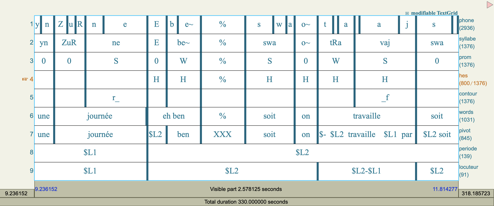

```{=html}
<div class="lang-switcher">
  <a href="index.html" title="Version française">🇫🇷</a>
  <span class="lang-label">FR</span>
</div>
```

```{r}
#| message: false
#| echo: false
Sys.setenv(LANG = "en")

source("funs.R")
set.seed(1L)

library(dplyr)
library(ggplot2)
library(forcats)
options(dplyr.summarise.inform = FALSE)
theme_set(theme_minimal())
```

[Exercise solutions](atelier_exercices_en.html)

In this workshop, I present an introduction to the R language for the study of
linguistics. R is a free, open-source programming language that is particularly
popular in the natural and social sciences. We begin with a general introduction
to functions for downloading, visualizing, and manipulating data structured as
tables. We then continue by studying specific models for the study of language.
We finish with the application of application programming interfaces (APIs) for
using large language models. In all examples, we use data drawn from various
areas of linguistics.

Although we cover the main concepts in the following notes, we suggest consulting the following additional resources to deepen your understanding:

- [*R for Data Science (2e)*](https://r4ds.hadley.nz/) A freely available book in English that covers the essential functions for data visualization, manipulation, and programming in R presented in these notes.
- [*Humanities Data in R (2e)*](https://humanitiesdata.org/text/) A book accessible in English (username and password are "hdir") that provides more advanced methods for handling complex and multimodal data.
- Cheatsheets:
[graphics](https://raw.githubusercontent.com/rstudio/cheatsheets/main/translations/french/data-visualization_fr.pdf),
[data wrangling](https://raw.githubusercontent.com/rstudio/cheatsheets/main/translations/french/data-wrangling_fr.pdf), and
[regular expressions](https://raw.githubusercontent.com/rstudio/cheatsheets/main/translations/french/regex_fr.pdf)

You will also find complete documentation on the various functions and packages on the [The Comprehensive R Archive Network (CRAN)](https://cran.r-project.org/web/packages/available_packages_by_name.html) website.

## 1. Philosophy

My philosophy for teaching data science is motivated by the goal of providing
the tools necessary for free exploration of data, rather than simply encouraging
the use of existing processing pipelines and static models. To achieve this goal,
I present this workshop organized around three principles:

- **tabular data**: I favor tabular data because it allows us to base our analyses
on theoretical structures. These theories come from fields such as computer
science, mathematics, statistics, and philosophy.
- **general, theory-based functions**:
I favor functions from packages like `dplyr` and ggplot2 rather than older
functions or functions that only work with a single data type.
This also helps us adapt to other programming languages such as Python, SQL,
or JavaScript.
- **a solid foundation**: We will focus on basic operations before moving on
to more complex tasks.

These principles require us to focus heavily on general functions for visualizing
and manipulating relatively simple data in the first sections. But, as you can
see in the table of contents on the right, this work will help us progress
quickly toward more complex topics... and to *understand* them once we get there.

## 2. Configuration

Like all skills, the only way to learn R is to practice by producing code
yourself. To help you do this, I provide exercises that correspond to each
section below. To follow along, [download R](https://cran.r-project.org/), [RStudio](https://posit.co/downloads/),
and the examples and data below onto your own computer.

```{=html}
<div class="buttons-container">
  <a href="https://distantviewing.org/atelier_r_linguistique.zip" class="button is-primary" target="_blank">
    <span>Télécharger le code</span>
  </a>
</div>
```

The exercises apply and deepen the topics covered using additional data.

There are collections of additional functions in *packages*. There are thousands
of open-source packages. Throughout this workshop, we will use several. The most
common way to download a package from R is given by the following code, in which
we download the **ggplot2** package.

```{r}
#| eval: false
install.packages("ggplot2")
```

After downloading the package, which only needs to be done once, we must load it
using the following code, which is run each time we start a new session in R.

```{r}
#| eval: false
library(ggplot2)
```

The code to download all the packages needed for the workshop is provided in the
linked documents above. We will use the `library` function to load each required
library before its first use in our code.

## 3. Tabular Data

We begin with data on the production of English vowels from a well-known study
of 139 speakers in 1995 (Hillenbrand et al.). I chose them because they are
small enough for a first application but complex enough to be interesting.

I have prepared this collection in a CSV file. You can also save your data in
CSV format using any spreadsheet application such as LibreOffice, Google Sheets,
or Excel. To load this data into R, we can use the `read_csv2` function from the
**readr** package. This function requires an argument specifying the file path
relative to the code. Here is an example of loading the English vowel
production data.

```{r}
#| message: false
library(readr)

read_csv2("donnees/hillenbrand_voyelle_eng.csv")
```

We see that this function returns an object called a "tibble". In R, a tibble
is the structure in which we load data structured as a table. The object above
has 1668 rows and 8 columns. Each row shows the metadata of a speaker and the
phonetic measurements of a vowel. By default, we only see the first ten rows.
For each column, there is a name (id, groupe, etc.) and a data type. Numeric
columns have the type \<dbl\>, an abbreviation of "double" in the expression
"double-precision floating-point number". Columns containing character strings
have the type \<chr\>, an abbreviation of the word "character". We will see that
these structures are essential for all stages of data analysis in R.

In the code above, we created and printed a tibble. However, after running the
code the tibble no longer exists in R. To save it, we must assign the function's
output to a name using an arrow (less-than sign and minus sign). Here, we save
the tibble in the object `phone`.

```{r}
#| message: false
phone <- read_csv2("donnees/hillenbrand_voyelle_eng.csv")
```

Then, after execution, we can use the phone object in any other task. For
example, in the next section, we will visualize this data with a language suited
to exploring quantitative information.

## 4. Visualize

Visualization is an essential step in data exploration. We will apply a general
language called the "grammar of graphics" to describe and code visualizations in
R. We need a little theory before continuing, but this framework makes complex
visualizations relatively easy to produce.

In the grammar of graphics, a layer consists of three elements:

- **a tibble**: The object containing the information to visualize.
- **a geometry**: The shape corresponding to each row of the tibble. The
visualization consists of one shape per row.
- **aesthetics**: The associations between columns of the tibble and the
parameters of each shape.

A visualization consists of one or more layers. An example helps clarify how
these parts can correspond to graphical elements. Here is the code to create a
visualization of our `phone` tibble with a point for each row, with horizontal
position indicated by the fundamental frequency (`f0`) and vertical position
indicated by the vowel duration (`dur`).

```{r}
library(ggplot2)

phone |>
  ggplot() +
  geom_point(aes(x = f0, y = dur))
```

In this example, we start with the name of a tibble (`phone`) followed by the
symbol `|>`. This symbol is called a "pipe". It passes the tibble to the next
steps. This construction allows us to adapt the order of functions and makes
them easier to read: `p(h(g(f(x))))` becomes `x |> f() |> g() |> h() |> p()`.

We continue with the `ggplot()` function to indicate that we want to create a
visualization. In the last line, we apply the geom_point function to specify the
geometry. Inside the function, we put the `aes()` function (for *aesthetic*)
with the associations between column names and horizontal and vertical positions.
By convention, the grammar of graphics uses the letter `x` for the horizontal
dimension and `y` for the vertical dimension.

As in the example above, the point geometry has two required aesthetics
(`x` and `y`). There are other optional aesthetics that can be added to enhance
the information conveyed by the visualization. For example, there is a colour
aesthetic that allows the colour of each point to be changed based on a column
of the tibble. Here is an example where colour indicates the speaker's group.

```{r}
phone |>
  ggplot() +
  geom_point(aes(x = f0, y = dur, colour = groupe))
```

Already, this visualization shows some correspondences between the columns. We
see that the difference in fundamental frequency corresponds to a separation
between men and the others. And that there may be a correspondence where men
have slightly shorter durations than women and children.

The link between colours and groups is not explicit in our code. The grammar of
graphics system can choose colours automatically. The same was true for the
horizontal and vertical positions. But often we need to change them. To specify
the relationship between aesthetics and the actual elements of a graph, we can
apply *scales*. Scales can be added as another line of our code. Here is an
example where we modify the colours using a palette adapted for colour-blind
people.

```{r}
phone |>
  ggplot() +
  geom_point(aes(x = f0, y = dur, colour = groupe)) +
  scale_colour_viridis_d()
```

Now let's look at the most common visualization for phonetic data, which shows
the relationship between the first two formants F1 and F2. This graph is
essentially the same thing: points with names `f2` and `f1`, respectively,
assigned to the `x` and `y` aesthetics. But there is a complexity. In order to
match the shape of the tongue for someone looking to their right, we need to
reverse the axis directions. This requires applying the `scale_x_reverse()` and
`scale_y_reverse()` scales. The following example gives the correct form.

```{r}
phone |>
  ggplot() +
  geom_point(aes(x = f2, y = f1)) +
  scale_x_reverse() +
  scale_y_reverse()
```

This visualization shows the classic triangular shape of the vowel space.
Suppose we want to see which vowels correspond to these points. How could we do
that? We need to apply a new geometry: `geom_text`. It does not create points
for each row of data. Instead, the text geometry places characters directly in
the graph. We need to give a new aesthetic to indicate which column corresponds
to these characters. Here is how to have a visualization with IPA symbols
instead of points.

```{r}
phone |>
  ggplot() +
  geom_text(aes(x=f2, y=f1, label = api)) +
  scale_x_reverse() +
  scale_y_reverse()
```

We can save a visualization with the `ggsave` function. By default, the last
displayed graph is saved.

```{r}
ggsave("ma_visualisation.png", height=12, width=12, units="cm")
```

There are many geometries, aesthetics, and scales available to expand the
possibilities of visualizations in the grammar of graphics. You can consult the
following references: [@wickham2023r ; @dplyr].

We have seen the central elements of the grammar of graphics. In order to go
further, we continue by studying methods for modifying tibbles with
database-oriented functions.

## 5. Manipulating a Table

Often, it is necessary to transform a data table into another table with
different or reorganized elements. In R, we can manipulate tables with a
collection of functions called "verbs". These functions have the same structure:
you give them a tibble and receive a new tibble. This structure allows any
number of functions to be applied to a tibble. There are about 50 verbs.
Fortunately, we only need to learn 12 to perform all possible operations. In
this section, we start with the first 8 verbs.

The `slice_head` verb slices the first `n` rows of a tibble, where `n` is an
argument in the function. Like all verbs, we use a pipe (`|>`) to pass the data
object to the function.

```{r}
library(dplyr)

phone |>
  slice_head(n = 4)
```

The `filter` verb keeps rows based on a relationship between values. To apply
this function, we place an expression inside it with column names. Rows where
the expression is true will be kept. Here is an example to find the rows for the
vowel «u».

```{r}
phone |>
  filter(api == "u")
```

To reorganize rows by values in one or more columns, we apply the `arrange`
function. We simply indicate the column name inside the function.

```{r}
phone |>
  arrange(dur)
```

Reorganizing rows by default sorts them in ascending order. For descending
order, we add the `desc` function.

```{r}
phone |>
  arrange(desc(dur))
```

To demonstrate the application of multiple verbs, note that it is often
efficient to apply `arrange` then `slice_head` to find rows with extreme values.
We see that each line, except the last, has a pipe at the end.

```{r}
phone |>
  arrange(desc(f1)) |>
  slice_head(n = 10)
```

The `mutate` verb adds a column to the table. This works with a name for the new
column and a formula to create it **from** other columns. For example, below is
an example of creating a `dur_s` column (duration in seconds) defined as
duration (in milliseconds) divided by 1000.

```{r}
phone |>
  mutate(dur_s = dur / 1000)
```

The `select` verb selects columns based on their names. It is useful if the
size of a table becomes too large.

```{r}
phone |>
  select(f1, f2)
```

We finish this section with two verbs that often work together: `group_by` and
`summarise`. Like `mutate`, the summarise verb allows creating new columns. But
it reduces rows to a summary by applying functions like `mean` (average) or `sd`
(standard deviation). The `group_by` function indicates by which column (or
columns) the summary is applied. This example can clarify the relationship
between the two. Here is the code to calculate the mean F1 and F2 values by
vowel.

```{r}
phone |>
  group_by(api) |>
  summarise(
    f1_m = mean(f1),
    f2_m = mean(f2)
  )
```

We can save the result of a data manipulation using an arrow (`<-`). This can
then be saved as a file that we can open in other software using `write_csv2`.
Here is an example:

```{r}
phone_moyenne <- phone |>
  group_by(api) |>
  summarise(
    f1_m = mean(f1),
    f2_m = mean(f2)
  )

write_csv2(phone_moyenne, "donnees/phone_moyenne.csv")
```

The power of the `summarise` function becomes clearer when applied to
visualizations. With a combination of verbs and graph layers, we have the tools
to visualize the mean formants of each vowel in the data.

```{r}
phone |>
  group_by(api) |>
  summarise(
    f1_m = mean(f1),
    f2_m = mean(f2)
  ) |>
  ggplot() +
    geom_point(aes(x=f2_m, y=f1_m), size = 8) +
    geom_text(aes(x=f2_m, y=f1_m, label = api), colour="#fff") +
    scale_x_reverse() +
    scale_y_reverse() 
```

I would like to mention here a very useful base R function for exploring data:
table. It can count the number of values in a column, for example (note the $
symbol between the table name and the column name):

```{r}
table(phone$api)
```

Or, it can also count combinations of two columns:

```{r}
table(phone$api, phone$groupe)
```

Now we have a solid foundation of verbs and visualization functions. All these
elements are at the heart of data science. In the next section, we add
modelling functions.

## 6. Statistical Models

Now that we know how to manipulate data, we can start working with new datasets.
Here, we load [a dataset](https://huggingface.co/datasets/ALTACambridge/KUPA-KEYS) from a
[keystroke logger](https://aclanthology.org/2024.lrec-main.938.pdf) in which
every keystroke made during a writing session is recorded.

```{r}
#| message: false
touches <- read_csv2("donnees/keylog-touches.csv.bz2", na="NA")
touches
```

Once the data is loaded, the following block performs a preparation step where
we filter observations to retain only two specific key types, here the space and
the period. This selection makes it easier to compare the keystroke duration of
these two categories.

```{r}
touches_sub <- touches |>
  filter(code %in% c("Space", "Period"))
```

After this preparation, we apply a statistical test to compare means. Student's
t-test allows us to evaluate whether the measured keystroke durations differ
significantly between the two key types retained. The idea is to verify whether
the space and period have systematically different press times, which could
reflect specific typing habits or mechanical constraints.

```{r}
t.test(dur ~ code, data = touches_sub)
```

The results show that there is a significant difference, and that the mean
duration of a period (86.04 ms) is greater than that of a space (78.45 ms).

The following block extends the analysis to another angle. This time, it is a
one-way ANOVA test that uses the session identifier as the explanatory variable.
The goal is to estimate whether keystroke duration varies greatly from one
individual to another. If the variability is large, this may indicate that
interpersonal differences play a determining role in typing speed or style.

```{r}
oneway.test(dur ~ id, data = touches)
```

Here again, we see that there is a difference in mean duration by session.

Finally, the last block proposes a linear regression analysis. The aim here is
to understand how the duration of a keystroke might be associated with the
duration that immediately follows it. The model seeks to determine whether
pressing a key for longer or shorter affects how quickly the next key is pressed.

```{r}
summary(lm(dur_apres ~ dur, data = touches))
```

The results show that there is a positive relationship between the duration of a
key and the duration of the next key. But the *coefficient of determination*
(also known as the "percentage of variance explained" or "Multiple R-squared")
is very small, indicating that this relationship is not very strong.

## 7. Multiple Tables

In this section, we will learn the last verbs we need. These verbs help us
combine information from multiple tables and complete the essentials of our verb
toolkit.

We begin by loading a second data table containing descriptive information about
users in the typing sessions. This file generally groups metadata such as
language, declared proficiency level, or other characteristics that help better
contextualize the measurements.

```{r}
#| message: false
meta <- read_csv2("donnees/keylog-meta.csv.bz2")
meta
```

We then import a third table, this time focused on measures related to the words
themselves. This might include, for example, keystroke durations associated with
each typed word, providing more synthetic information than a key-by-key analysis.

```{r}
#| message: false
mots <- read_csv2("donnees/keylog-mots.csv.bz2")
mots
```

Once these two tables are available, we perform a join between them based on a
common identifier. This operation allows us to combine the characteristics
present in the metadata with the word-level observations, enriching each row
with additional contextual information. The result is a merged table where
durations or other word-level measures can be interpreted in terms of user
profiles. Here is an example where we use the participant identifier (`id`)
to merge them.

```{r}
#| message: false
mots |>
  left_join(meta, by = "id")
```

The following block exploits this join to group by a variable describing
language proficiency level. After grouping observations by this criterion, the
median of a specific timing measure is calculated, providing a robust performance
indicator for each level. The final sort highlights the levels with the highest
median, facilitating global comparison.

```{r}
#| message: false
mots |>
  left_join(meta, by = "id") |>
  group_by(cefr) |>
  summarise(mu = median(d1)) |>
  arrange(desc(mu))
```

Finally, on a similar principle, the analysis is repeated by grouping the data
by declared language. The aim is to examine whether word performance varies
noticeably from one native language to another.

```{r}
#| message: false
mots |>
  left_join(meta, by = "id") |>
  group_by(lang) |>
  summarise(mu = median(d1)) |>
  arrange(desc(mu))
```

We see that English students typed the fastest.

## 8. Sliding Windows

We have covered horizontal analyses in which we only see relationships between
values within a row. With `summarise` and the statistical model functions, we
have also covered vertical analyses in which we process all the values in a
column across all rows, or all groups of rows. In this section, we go further by
using what are called sliding window functions. These functions help us find
relationships between observations based on the order of rows in our data.
Sliding window functions are very useful when working with time series, as is
often the case in linguistics.

We start by creating a simplified table containing only the essential variables
to illustrate the use of window functions.

```{r}
touches_min <- select(touches, id, t0, t1, dur, touche, code)
touches_min
```

The following block illustrates the use of several classic window functions such
as `lag` and `lead`, frequently used in the analysis of time series or ordered
sequences. They allow us to "see" the rows before and after. The `n` argument
gives the number of rows to access.

```{r}
touches_min |>
  arrange(id, t0) |>
  group_by(id) |>
  mutate(
    diff_avant = t0 - lag(t0, n=1),
    diff_apres = lead(t0, n=1) - t0,
    gap_avant = t0 - lag(t1, n=1),
    gap_apres = lead(t0, n=1) - t1,    
  )
```

There are other window functions in the **slider** package that help us calculate
more complex summaries. For example, `slide_mean` gives the mean of a window
around each row of a specified size.

```{r}
library(slider)

touches_min |>
  filter(id == "R_00RbUqO7jXLDItP") |>
  arrange(t0) |>
  mutate(
    dur_moyenne10 = slide_mean(dur, before=10),
    dur_moyenne100 = slide_mean(dur, before=100),
    dur_moyenne1000 = slide_mean(dur, before=1000) 
  ) |>
  ggplot() +
    geom_line(aes(x=t0, y=dur_moyenne10), colour = "#fa8072") +
    geom_line(aes(x=t0, y=dur_moyenne100), colour = "#808000") +
    geom_line(aes(x=t0, y=dur_moyenne1000), colour = "#6fa8dc")     
```

Finally, the last block explores the use of larger sliding windows to compute
moving averages over different horizons. After filtering for a specific user, we
order their keystrokes and then apply several window sizes to progressively
smooth the observed durations. This gives curves more or less sensitive to local
variations: a small window closely follows instantaneous changes, while a large
window highlights broader trends. The resulting graph overlays these different
averages, offering an intuitive visualization of the evolution of typing rhythm
over time.

## 9. Character Strings

In this section, we introduce the use of functions from the **stringi** package
to manipulate text data \cite{stringi}. These functions have the same form: the
name starts with `stri_` and the first argument is a character sequence. For
example, here is the `stri_length` function that counts the number of characters
in a sequence.

```{r}
library(stringi)

mots |>
  mutate(nchar = stri_length(mot))
```

The following block combines this new information with that from the metadata
table. After joining the two tables on the user identifier, we group the words
by language, then calculate the average word length for each group. This type of
summary helps compare the different languages present in the corpus, examining
whether some systematically have longer words, which could influence the observed
typing dynamics.

```{r}
mots |>
  mutate(nchar = stri_length(mot)) |>
  left_join(meta, by = "id") |>
  group_by(lang) |>
  summarise(mu = mean(nchar, na.rm=TRUE)) |>
  arrange(desc(mu))
```

Most stringi functions require a fixed argument to specify what they do. For
example, the `stri_detect` function indicates the presence of a character
sequence. Here we apply it to indicate which words contain the character \<a\>
using the `fixed` argument.

```{r}
mots |>
  mutate(nombre_a = stri_detect(mot, fixed = "a"))
```

Often, we do not just want to search for a given sequence. Instead, we need to
find rows that match a set of characters. For this, we apply "regular
expressions", a language for describing patterns in character sequences. For
example, the expression `[A-Z]` indicates uppercase Latin letters.

```{r}
mots |>
  mutate(nombre_maj = stri_detect(mot, regex = "[A-Z]"))
```

After detecting uppercase letters and recalculating word length, we filter the
shortest cases to facilitate visualization. The data is then grouped by length
and by the presence or absence of an uppercase letter, before calculating a
median of the durations associated with typing the word. The resulting graph
illustrates these trends by showing, for each length, any differences between
the two word types, providing a clear visual overview of variations related to
text formatting.

```{r}
mots |>
  mutate(has_maj = stri_detect(mot, regex = "[A-Z]")) |>
  mutate(nchar = stri_length(mot)) |>
  filter(nchar < 10) |>
  group_by(nchar, has_maj) |>
  summarise(mu = median(dur_mot)) |>
  ggplot() +
    geom_point(aes(x=factor(nchar), y=mu, colour = has_maj))
```

There are many other stringi functions with the same form, offering a choice of
a fixed phrase or a regular expression. For example, I often use `stri_count`,
`stri_replace`, `stri_extract` and `stri_match`.

We do not have time for a complete introduction to regular expressions. Here are
the most common symbols for linguistics:

- `\w` : any word character (a-z, 0-9, à, è, é, etc.)
- `\W` : the opposite, i.e., spaces, commas, periods, etc.
- `\A` : indicates the beginning of a string
- `\Z` : indicates the end of a string
- '+' : indicates one or more occurrences of the preceding symbol

For a reference of all the options, I recommend the [Mozilla Cheatsheet](https://developer.mozilla.org/en/docs/Web/JavaScript/Guide/Regular_expressions/Cheatsheet), which is accessible in English or French.

## 10. TextGrid

In this section, we work with TextGrid format files, a format commonly used in
phonetics to annotate audio recordings, originating from the Praat software
[@styler2013using]. We will study data from a corpus called
[Rhapsodie](https://rhapsodie.modyco.fr/presentation/). Rhapsodie provides a
syntactic and prosodic database for spoken French
[@lacheret2014rhapsodie]. Here is an example of a TextGrid from the Rhapsodie
corpus in Praat.



This TextGrid file contains several annotation tiers, each representing different
information such as phonetic segments, prosodic contours, or other temporal
markers. The annotation tiers are called "tiers". In Praat, annotations are
organized in different layers aligned by their timing.

Here we load a file from the Rhapsodie corpus into R using the **readtextgrid**
package [@readtextgrid].

```{r}
#| message: false
library(readtextgrid)

tg <- read_textgrid("donnees/rhapsodie/tg/Rhap-M0018-Pro.TextGrid")
tg
```

The format in R is very different from the format in Praat. In R, the temporal
dimensions of the tiers are not directly linked to each other. All the data from
one tier (here `phone`) is provided, followed by the second tier, and so on.
This format is not as well suited for direct data consultation, but is rather
optimized for programming.

The following block specifically extracts the tier corresponding to phonemes,
called "phone" in the file. This tier contains a fine segmentation of speech
where each entry represents a phonetic segment delimited in time.

```{r}
tg_phone <- tg |>
  filter(tier_name == "phone")
tg_phone
```

We then proceed with a descriptive analysis of phoneme durations. By eliminating
segments marked by a fill symbol, we group phonemes by type and calculate the
corresponding mean duration. This allows us to visualize, as a scatter plot, the
shortest and longest phonemes, revealing natural phonetic tendencies such as the
brevity of reduced vowels or the relative slowness of certain consonants.

```{r}
tg_phone |>
  filter(text != "_") |>
  group_by(text) |>
  summarise(dur_moyenne = mean(xmax - xmin)) |>
  arrange(dur_moyenne) |>
  ggplot() +
    geom_point(aes(x=fct_inorder(text), y=dur_moyenne))
```

The following block extracts another tier, here called `contour`, which may
represent prosodic categories or melodic levels associated with speech. By
filtering this tier to keep only certain selected symbols, we focus on the main
annotation categories needed for analysis. Displaying the resulting table allows
us to verify that the retained entries are as expected before using them as
reference elements for a merge with the phonemes.

```{r}
tg_contour <- tg |>
  filter(tier_name == "contour") |>
  filter(text %in% c("M", "C", "H", "L"))
tg_contour
```

The following block illustrates a more advanced operation: joining phonemic and
prosodic information based on their temporal overlaps using the `join_by`
function. This join exploits a condition where a phoneme is associated with a
prosodic category if its temporal boundaries are contained within the
corresponding contour interval. The result is an enriched table where each
phoneme carries, in addition to its own label, the corresponding prosodic
annotation. This type of temporal join is common in speech processing to link
different levels of analysis.

```{r}
tg_join <- tg_phone |>
  left_join(
    select(tg_contour, xmin, xmax, text),
    by = join_by(
      xmin >= xmin,
      xmax <= xmax
    ),
    suffix = c("", "_contour")
  )
tg_join
```

Finally, we end with a cross-tabulation summarizing the distribution of phonemes
across associated prosodic categories.

```{r}
tg_join |>
  filter(text != "_") |>
  group_by(text) |>
  summarise(
    moyenne_l = mean(text_contour == "L", na.rm=TRUE),
    n = n()
  ) |>
  arrange(moyenne_l) |>
  filter(n > 20) |>
  print(n = Inf)
```

This table allows us to quickly identify which combinations appear frequently
and which are rare or absent. Such an overview can help detect typical prosodic
structures or identify possible inconsistencies in the annotation.

## 11. Programming

The analysis in the last section only uses a single file. The Rhapsodie corpus
consists of about 60 files. It is not practical to write code to load them one
by one. Instead, we need programming functions in R to apply our analysis to
each file.

Here is an example of code that (1) finds files in TextGrid format (with `dir`),
(2) applies a loop over each file, and (3) combines all results into a large
table (with `bind_rows`).

```{r}
dir_nom <- "donnees/rhapsodie/tg/"
d <- dir(dir_nom, pattern="TextGrid$")

df <- list("vector", length(d))
for (j in seq_along(d)) {
  tg <- read_textgrid(file.path(dir_nom, d[j]), encoding="UTF-8")
  tg$id <- j

  # ↓↓↓ cette partie ci-dessous fonctionne de traiter une seule
  # ↓↓↓ fiche ; vous pouvez la changer 
  tg_phone <- tg |>
    filter(tier_name == "phone")
  tg_contour <- tg |>
    filter(tier_name == "contour") |>
    filter(text %in% c("M", "C", "H", "L"))
  res <- tg_phone |>
    left_join(
      select(tg_contour, xmin, xmax, text),
      by = join_by(
        xmin >= xmin,
        xmax <= xmax
      ),
      suffix = c("", "_contour")
    )
  # ↑↑↑

  df[[j]] <- res
}

df <- bind_rows(df)
df
```

The part between the arrows indicates where I have added code specific to each
file.

After obtaining the `df` table, we can apply the same verbs we used in the
previous section.

```{r}
df |>
  filter(text != "_") |>
  group_by(text) |>
  summarise(
    moyenne_l = mean(text_contour == "L", na.rm = TRUE),
    n = n()
  ) |>
  arrange(moyenne_l) |>
  filter(n > 20) |>
  print(n = Inf)
```

We see that the results become more stable with all the files.

## 12. Audio Data

It is possible to analyze audio files (.mp3, .wav, etc.) directly in R. Here we
load a file containing the pronunciation of the vowel /i/ in French using the
`readWave` and `makesound` functions, from the **tuneR** and **phonTools**
packages respectively
[@tuneR; @phonTools].

```{r}
#| message: false
library(tuneR)
library(phonTools)

w <- readWave("donnees/voyelles/i.wav")
snd <- makesound(w@left, fs = w@samp.rate)
snd
```

The result gives a specific object ("Sound Object") that we can study with
functions from the **phonTools** package. For example, we can calculate the
intensity of the sound with `powertrack`. By default, the function creates a
visualization at the same time.

```{r}
power <- powertrack(snd, fs = fs)
```

As always, we would like to organize the information in a table and then apply
all the general functions for visualization, manipulation, and modelling.

```{r}
power <- as_tibble(power)
power
```

We can do the same with formants using the `formanttrack` function.

```{r}
formants <- formanttrack(snd, fs = fs)
```

And also, we can create tabular data.

```{r}
formants <- as_tibble(formants)
formants
```

To go further, we need to apply programming functions to calculate the intensity
curve and formants for each vowel (which are in their own files). We can apply
and modify the example in Section 11. Here is the code that saves the formants
at the point of maximum intensity for each vowel.

```{r}
dir_nom <- "donnees/voyelles"
d <- dir(dir_nom, pattern="wav$")

df <- list("vector", length(d))
for (j in seq_along(d)) {
  w <- readWave(file.path(dir_nom, d[j]))
  snd <- makesound(w@left, fs = w@samp.rate)

  # ↓↓↓ cette partie ci-dessous fonctionne de traiter une seule
  # ↓↓↓ fiche ; vous pouvez la changer 
  power <- powertrack(snd, fs = fs, show=FALSE)
  power <- as_tibble(power)

  formants <- formanttrack(snd, fs = fs, show=FALSE)
  formants <- as_tibble(formants)

  t_haut <- arrange(power, desc(power))$time[1]
  res <- arrange(formants, abs(time - t_haut))[1,]
  res$fname <- d[j]
  # ↑↑↑

  df[[j]] <- res
}

df <- bind_rows(df)
df
```

We can recreate the visualization as in Section 4 with the formants from these
examples.

```{r}
df |>
  mutate(api = stri_replace(fname, "", fixed = ".wav")) |>
  ggplot() +
    geom_text(aes(x=f2, y=f1, label = api)) +
    scale_x_reverse() +
    scale_y_reverse()
```

Finally, I note that it is also possible to use the `pitchtrack` function in the
same way to calculate the fundamental frequency of a sound file.

## 13. Grammatical Analysis

In this section, we explore automatic grammatical analysis using **udpipe**, a
tool that allows detailed automatic annotation of text: word identification,
lemmatization, grammatical categorization, and detection of morphological
features [@udpipe].

The first block loads a pre-trained language model for French. This model is
derived from the GSD corpus [@guillaume2019conversion]. If no model is
specified, it will be downloaded automatically.

```{r}
#| message: false
library(udpipe)

udmodel_fr <- udpipe_load_model(file = "donnees/french-gsd-ud-2.5-191206.udpipe")
```

The following block applies this model to a literary text, the "tirade du nez"
[@Rostand2006_Cyrano]. The text is in raw format and then passed to the
annotation engine, which segments words, identifies their grammatical category,
lemma, and morphological features. The result, converted to a tibble, allows
annotations to be inspected row by row.

```{r}
#| message: false
txt_tirade <- read_lines("donnees/tirade_du_nez.txt")
df_tirade <- as_tibble(udpipe_annotate(
  udmodel_fr, x = txt_tirade
))
df_tirade
```

Applying `udpipe_annotate` can take several hours for large datasets.
Fortunately, since the results are a table, we only need to apply it once, save
to a file, and then load it for re-analysis.

In the following block, we load a corpus drawn from Wikipedia (3 percent of all
articles), already preprocessed to include grammatical annotations. This large
corpus allows us to study the grammatical habits of thousands of sentences,
opening the way to more ambitious quantitative analyses.

```{r}
#| message: false
wikifr <- read_csv2("donnees/wiki_parsed.csv.bz2")
wikifr
```

The following block performs an analysis focused on verbs and their conjugated
tenses using functions from the stringi package. We first filter entries to keep
only verbs that carry a morphological feature indicating a verb tense. We then
detect the presence of several tenses (present, imperfect, and past) by counting
how many times each feature appears in the annotations. By grouping occurrences
by lemma, we obtain an estimate of the average frequency of verb tenses used for
each verb. After filtering sufficiently frequent lemmas, we sort the results to
highlight those where the present tense appears least often. This approach shows
how to extract general grammatical trends from a large corpus.

```{r}
wikifr |>
  filter(pos == "VERB") |>
  filter(stri_detect(morph, fixed = "Tense=")) |>
  mutate(
    pres = stri_count(morph, fixed = "Tense=Pres"),
    imp = stri_count(morph, fixed = "Tense=Imp"),
    passe = stri_count(morph, fixed = "Tense=Past")
  ) |>
  group_by(lemma) |>
  summarise(
    pres_moyenne = mean(pres),
    imp_moyenne = mean(imp),
    passe_moyenne = mean(passe),
    n = n()
  ) |>
  filter(n > 800) |>
  arrange(pres_moyenne) |>
  print(n = Inf)
```

It is also possible to train models ourselves. To do this, we load a corpus in
CoNLL-U format, a standard structure used in the Universal Dependencies project
to represent complete linguistic annotations. This file contains manually
annotated examples, making it a valuable resource for training or evaluating
models. The conversion to a tibble makes it easy to inspect the columns,
including words, lemmas, grammatical tags, and syntactic dependencies.

```{r}
#| message: false
ud <- as_tibble(udpipe_read_conllu("donnees/fr_sequoia-ud-train.conllu"))
ud
```

The following block shows how to train your own UDPipe model from an annotated
corpus. Training involves learning a tokenizer, a morphosyntactic tagger, and a
dependency parser. The results are saved in the `exemple_fr.udpipe` file.

```{r}
#| eval: false
m <- udpipe_train(
  file = "donnees/exemple_fr.udpipe",
  files_conllu_training = "donnees/fr_sequoia-ud-train.conllu", 
  annotation_tokenizer = "default",
  annotation_tagger = "default",
  annotation_parser = "default"
)
```

Finally, the last block loads this newly trained model and then applies it to
the tirade text to compare the results with those of the standard model. This
step allows us to evaluate annotation differences, observe any improvements or
divergences, and concretely illustrate the importance of model choice in an
automated grammatical analysis pipeline.

```{r}
#| message: false
udmodel_fr_nouv <- udpipe_load_model(
  file = "donnees/exemple_fr.udpipe"
)
df_tirade_nouv <- as_tibble(udpipe_annotate(
  udmodel_fr_nouv, x = txt_tirade
))
df_tirade_nouv
```

We will analyze the differences between these results and those of the standard
model in a subsequent section.

## 14. PCA + UMAP

In this section, we explore two widely used dimensionality reduction methods,
PCA ([principal component analysis](https://en.wikipedia.org/wiki/Principal_component_analysis))
and UMAP, which allow complex data to be represented in a low-dimensional space
while preserving their structure as much as possible.

The context here is the analysis of word vector representations obtained by a
[fastText](https://fasttext.cc/docs/en/crawl-vectors.html) model, which
generates for each word a high-dimensional vector reflecting its semantic
similarities in large text corpora [@fasttext]. Reducing these vectors to two
dimensions allows relationships between words to be visualized at a glance. We
will see other applications of these methods in the following sections.

```{r}
#| message: false
fl <- read_csv2("donnees/fruitlegumes.csv")
fl
```

The first block loads a table containing a list of fruits and vegetables along
with an indication of their category. This table will serve as a reference to
associate each word (for example "pomme", "carotte") with its class ("fruit" or
"légume"), which will facilitate the visualization and interpretation of results
produced by the dimensionality reduction methods.

We then load a matrix of embedding vectors, i.e., a numerical representation of
the meaning of words. Each word corresponds to a row in the matrix and each
column to a latent dimension. By matching the names from the fruit/vegetable
table to the rows of this matrix, we extract the vectors useful for our analysis.

```{r}
embed <- read_rds("donnees/fasttext_embed.rds")
idx <- match(fl$nom, rownames(embed))
X <- embed[idx, ]
dim(X)
```

The following block applies PCA to the vectors. This linear method aims to
project the data into a lower-dimensional space by preserving the direction of
maximum variance.

```{r}
apc <- prcomp(X, center = TRUE, scale. = TRUE)
fl$apc1 <- apc$x[, 1]
fl$apc2 <- apc$x[, 2]
fl
```

We retain here the first two principal components and add them to the initial
table so that they can be used directly for display. This allows us to visualize,
in simplified form, how word representations are distributed in the space.

Once the two components are extracted, we represent them graphically. Each point
corresponds to a fruit or vegetable, the colour denotes the category, and text
labels facilitate individual identification. This visualization generally
highlights natural groupings: for example, fruits tend to cluster in one area of
the plot, vegetables in another, illustrating the ability of embeddings to
capture relevant semantic dimensions.

```{r}
fl |>
  ggplot() +
    geom_point(aes(x=apc1, y=apc2, colour = type)) +
    geom_text(
      aes(x=apc1, y=apc2, label = nom, colour = type),
      size = 2,
      nudge_y = -0.25
    )
```

The following block applies UMAP, a much more flexible non-linear method than
PCA. UMAP seeks to preserve the local structure of the data and is particularly
effective at revealing compact groups and fine semantic relationships. We use the
**umap** package and the `umap` function [@umap].

```{r}
library(umap)

obj <- umap(X)
fl$umap1 <- obj$layout[, 1]
fl$umap2 <- obj$layout[, 2]
```

The resulting coordinates are added to the main table so that they can be
visualized in the same way as the PCA components.

```{r}
fl |>
  ggplot() +
    geom_point(aes(x=umap1, y=umap2, colour = type)) +
    geom_text(
      aes(x=umap1, y=umap2, label = nom, colour = type),
      size = 2,
      nudge_y = -0.1
    )
```

The last visualization shows the result of UMAP in a two-dimensional plot. This
type of projection can reveal structures that PCA does not highlight, such as
more subtle subgroups or more coherent semantic distances at small scales. The
combination of colours and labels makes reading intuitive and facilitates
comparison of the two dimensionality reduction approaches.

## 15. Predictive Models

In this section, we address the construction of a predictive model from textual
data derived from words typed by users. The goal is to illustrate how to
transform raw data into a set of features usable by a supervised learning
algorithm. We use data from movie reviews from the
[Allociné.fr](https://github.com/TheophileBlard/french-sentiment-analysis-with-bert)
website. We use it for sentiment analysis.

We begin by importing the linguistic analysis data. This file contains the
tokenized and lemmatized words from each document.

```{r}
#| message: false
parse <- read_csv2("donnees/polarity_parse.csv.bz2")
parse
```

We then load the metadata containing in particular the target variable (polarity)
that we seek to predict.

```{r}
#| message: false
meta <- read_csv2("donnees/polarity_meta.csv.bz2")
meta
```

This step transforms the text into a sparse matrix with `to_sparse`. We
normalize lemmas to lowercase with `stri_trans_tolower`, then filter to keep
only words appearing more than 200 times. Each row represents a document and
each column a lemma.

```{r}
X <- parse |>
  mutate(lemma = stri_trans_tolower(lemma)) |>
  group_by(lemma) |>
  filter(n() > 200) |>
  to_sparse(doc_id, lemma)
dim(X)
```

We create a tibble that associates each document identifier with the
corresponding metadata using `left_join`, ensuring alignment between X and the
labels.

```{r}
df_meta <- tibble(doc_id = as.numeric(rownames(X))) |>
  left_join(meta, by = "doc_id")
df_meta
```

We randomly split the data into a training set (10,000 observations) and a
validation set. This split allows the model's performance to be evaluated on
unseen data.

```{r}
ind_train <- sort(sample(seq_len(nrow(X)), 10000))
ind_valid <- setdiff(seq_len(nrow(X)), ind_train)
```

We train a regularized logistic regression with `cv.glmnet` from the **glmnet**
package [@glmnet]. The `family="binomial"` option specifies a binary
classification problem and automatically performs cross-validation to select the
optimal regularization parameter.

```{r}
#| message: false
library(glmnet)

model <- cv.glmnet(
  X[ind_train,], df_meta$polarity[ind_train], family="binomial"
)
```

We generate predictions on the validation set with `predict` and calculate the
overall accuracy rate by comparing predictions to true values.

```{r}
pred <- predict(model, newx=X[ind_valid,], type = "class")
mean(pred == df_meta$polarity[ind_valid])
```

The `table` function creates a confusion matrix detailing true positives, true
negatives, false positives, and false negatives, offering a more complete view
of the model's performance.

```{r}
table(pred=pred, y=df_meta$polarity[ind_valid])
```

We extract the non-zero coefficients from the model with coef() to identify the
most influential lemmas. Positive coefficients indicate an association with one
class, negative ones with the other.

```{r}
#| eval: true
cf <- coef(model, s = model$lambda[5])
cf <- cf[cf[,1] != 0,,drop=FALSE][-1,,drop=FALSE]
cf[order(cf[,1]),,drop=FALSE]
```

We see several words associated with each polarity.

## 16. LLM

Large language models (abbreviated LLM) give conversational agents the ability
to understand and respond to free-text input. LLMs cannot be run directly in R,
but they can be accessed via an API. An API allows an LLM to be used from
various software, either locally or via an external paid service. Two common
software tools for using LLMs locally are [ollama](https://ollama.com/) and
[LM Studio](https://lmstudio.ai/).

Here is an example of using an LLM with the `oai_chat` function, LM Studio, and
an open-source model from OpenAI. We could use a different service by modifying
the `base_url` parameter or a different model by modifying the `model` parameter.

```{r}
#| eval: false
msg <- "Combien de personnes vivent dans le 11e arrondissement de Paris ?"

res <- oai_chat(
  base_url = "http://localhost:1234",
  model = "openai/gpt-oss-20b",
  msg = msg,
  temperature = 0.7,
)
res
```
```{r}
#| echo: false
res <- read_lines("donnees/llm_exemple.txt")
cat(res)
```

LLMs open up many possibilities for extending textual data analysis. For
example, instead of training a supervised model from human annotations, we can
use an LLM to generate annotations at scale. Let's now try this with a subset
of our movie review data.

Below is the code that asks an LLM to evaluate the polarity, certainty, and
conviction of a review. The result is returned in
[JSON format](https://developer.mozilla.org/en/docs/Learn_web_development/Core/Scripting/JSON),
commonly used for transmitting data via an API.

```{r}
#| eval: false
msg <- c(
  'Évaluer le degré de conviction, le degré de certitude et le caractère',
  'positif de ce texte sur une échelle de 1 (peu convaincant/certain/positif)',
  'à 10 (très convaincant/certain/positif). Indiquez votre évaluation dans une',
  'forme pur JSON. Par exemple :',
  '{"conviction": 4, "certain": 8, "positif": 2}.\n\n'
)

res <- oai_chat(
  base_url = "http://localhost:1234/v1/chat/completions",
  model = "openai/gpt-oss-20b",
  msg = paste(msg, document, collapse=" "),
  temperature = 0.7,
)
res
```
```{r}
#| echo: false
res <- "{\"conviction\": 7, \"certain\": 8, \"positif\": 5}"
cat(res)
```

Data in JSON format can be easily parsed in R using the `fromJSON` function from
the **jsonlite** package [@jsonlite].

```{r}
library(jsonlite)

as_tibble(fromJSON(res))
```

We import the annotation results produced by the LLM for all documents. These
annotations will serve as new labels for training a model.

```{r}
#| message: false
llm <- read_csv2("donnees/polarity_llm.csv.bz2")
llm
```

The `table` function creates a cross-tabulation comparing the original polarity
with the positivity score generated by the LLM, allowing us to evaluate the
consistency between the two measures.

```{r}
table(llm$polarity, llm$positif)
```

We train a new glmnet model using the LLM-generated polarity annotations as the
target variable. The X matrix is first filtered to keep only the annotated
documents.

```{r}
X_nouv <- X[as.character(llm$doc_id),]
model <- cv.glmnet(X_nouv, llm$positif)
```

We extract and sort the non-zero coefficients to identify which lemmas are most
associated with the LLM's polarity judgements, potentially revealing different
patterns from those of the previous model.

```{r}
#| eval: true
cf <- coef(model, s = model$lambda[12])
cf <- cf[cf[,1] != 0,,drop=FALSE][-1,,drop=FALSE]
cf[order(cf[,1]),,drop=FALSE]
```

This section demonstrates a hybrid strategy where an LLM serves as an automatic
annotator to create training data. By comparing the coefficients of the model
trained on LLM annotations with those of the model based on original annotations,
we can identify differences in the linguistic patterns captured by each approach.
This method is particularly useful when human annotation is costly or when we
wish to rapidly explore different dimensions of textual analysis. However, it is
important to validate the quality of LLM annotations and to understand that the
resulting model reflects the biases and capabilities of the LLM used for
annotation.

## 17. Whisper

Whisper is a speech recognition model developed by OpenAI capable of
automatically transcribing audio to text with a high level of accuracy. This
section shows how to use the Whisper API to transcribe a French audio file and
obtain not only the complete text, but also the precise time of each word. This
temporal segmentation capability is particularly useful for linguistic analysis,
text-audio alignment, or the creation of automatic subtitles.

We send an MP3 audio file to the Whisper API with the `oai_transcriptions`
function. The parameters specify the model to use ("whisper-1") and the source
language ("fr"), and the time granularity (segments and individual words).

```{r}
#| eval: false
Sys.setenv(OPENAI_API_KEY = "AJOUTEZ_ICI")

trans <- oai_transcriptions(
  file = "donnees/rhapsodie/mp3/Rhap-D0001.mp3",
  model_name = "whisper-1",
  language = "fr"
)

whisper_mots <- as_tibble(trans$words)
whisper_mots
```
```{r}
#| echo: false
transcription <- read_json("donnees/Rhap-D0001.json", simplifyVector = TRUE)
whisper_mots <- as_tibble(transcription$words)
whisper_mots <- tidyr::unnest(whisper_mots, cols = everything())
whisper_mots
```

Programmatic access to the Whisper API via R facilitates the integration of
speech recognition into broader data analysis pipelines, opening the way for
systematic study of large amounts of audio data.

## 18. Text Embeddings

Text embeddings are dense vector representations that capture the semantic
meaning of documents in a reduced-dimensional space. Unlike bag-of-words
representations that create sparse high-dimensional vectors, embeddings produced
by models like OpenAI's text embeddings generate dense vectors of a few thousand
dimensions where semantically similar texts are close in vector space. This
section shows how to obtain embeddings via the OpenAI API, use them to train a
predictive model, and visualize the semantic structure of documents in two
dimensions with UMAP.

To access LLM-based embeddings, we again use an API, this time with the
`oai_embeddings` function. In this example, we will use a proprietary OpenAI
model, but it is also possible to modify the URL to use a local model.

```{r}
#| eval: false
Sys.setenv(OPENAI_API_KEY = "AJOUTEZ_ICI")

res <- oai_embeddings(
  input = "Que sais-je?",
  model = "text-embedding-3-large"
)

dim(res)
```
```{r}
#| echo: false
res <- read_rds("donnees/embed_ex_saisje.rds")
length(res)
```

We see that this text embedding has a dimension of 3072. Note that the dimension
does not change depending on the size of the text.

We load a pre-computed dataset of embeddings from a sample of movie reviews.

```{r}
X <- read_rds("donnees/polarity_embed.rds")
dim(X)
```

We create a reduced training set (700 observations) and a validation set with
`sample`. Since embeddings are rich representations, even a small training set
can produce good results.

```{r}
ind_train <- sort(sample(seq_len(nrow(X)), 700))
ind_valid <- setdiff(seq_len(nrow(X)), ind_train)
```

We train a logistic regression with ridge regularization (alpha=0) via
`cv.glmnet`. L2 regularization is particularly well-suited to embeddings as it
penalizes all dimensions uniformly without eliminating any completely.

```{r}
model <- cv.glmnet(
  X[ind_train,], llm$polarity[ind_train], family="binomial", alpha=0
)
```

We generate predictions on the validation set with `predict` and calculate
overall accuracy. Since embeddings capture deep semantics, performance can be
high even with little training data.

```{r}
pred <- predict(model, newx=X[ind_valid,], type = "class")
mean(pred == llm$polarity[ind_valid])
```

The `table` function produces a confusion matrix detailing the distribution of
correct and incorrect predictions, allowing any biases in the model to be
identified.

```{r}
table(pred=pred, y=llm$polarity[ind_valid])
```

We apply UMAP with `umap` to project the high-dimensional embeddings into two
visualizable dimensions. This dimensionality reduction technique preserves local
structure and reveals semantic groupings in the data.

```{r}
obj <- umap(X)
llm$umap1 <- obj$layout[, 1]
llm$umap2 <- obj$layout[, 2]
```

We create a scatter plot with ggplot() showing the UMAP projection coloured by
positivity score. This visualization reveals whether documents with similar
positivity form distinct clusters in semantic space.

```{r}
llm |>
  mutate(positif = factor(positif)) |>
  ggplot() +
    geom_point(aes(x=umap1, y=umap2, colour = positif), size=6, alpha=0.4) +
    scale_colour_viridis_d()
```

This section illustrates the power of text embeddings for analysis and
classification. Compared to bag-of-words representations, embeddings capture
complex semantic relationships and allow good performance to be achieved with
less training data. The UMAP visualization reveals the underlying semantic
structure of the documents, showing how the embedding model organizes texts
according to their meaning. This approach is particularly effective for tasks
requiring nuanced understanding of textual content, and can easily be integrated
into more complex machine learning pipelines.

## 19. Text Alignment

When we analyze the same text with different models or linguistic annotation
tools, it is essential to be able to systematically compare their outputs. This
section presents the alignment of two annotations of the same text produced by
different models. By aligning corresponding tokens, we can identify divergences
in the analyses (morphosyntactic tags, lemmas, dependency relations) and evaluate
the consistency or differences between the models. This approach is crucial for
model validation, improvement of analysis pipelines, or understanding the
strengths and weaknesses of different annotation systems.

We use the alignement_des_textes() function to match the tokens from the two
annotations based on the token column. The suffix_y = "_nouv" parameter adds a
suffix to the columns of the second annotation to distinguish them, creating a
combined tibble where each row contains the information from both models for the
same token.

```{r}
df_comb <- alignement_des_textes(
  df_tirade,
  df_tirade_nouv,
  col1 = token,
  col2 = token,
  suffix_y = "_nouv"
)

df_comb
```

We filter the rows where the morphosyntactic tags differ between the two models
using filter(upos != upos_nouv). The select() function allows us to display the
tokens, lemmas, and tags from both annotations side by side, precisely revealing
where and how the models diverge in their analysis.

```{r}
df_comb |>
  filter(upos != upos_nouv) |>
  select(token, lemma, token_nouv, lemma_nouv, upos, upos_nouv)
```

This section demonstrates the importance of alignment for systematic comparison
of linguistic annotations. By matching the outputs of different models, we can
quantify their agreement, identify problematic cases, and better understand the
annotation choices of each system. This approach is particularly useful for
evaluating new models, diagnosing errors, or choosing the best tool for a
specific task. Alignment thus constitutes a fundamental step in any rigorous
textual analysis workflow involving multiple annotation sources.

## 20. Conclusions

This journey through various techniques for processing and analyzing textual and
temporal data has shown the wealth of tools available in R for exploring
linguistic corpora, whether derived from keystrokes, phonetic annotations,
literary texts, or large web-sourced collections. Starting from simple table
transformations and descriptive statistics, we have progressively extended the
range of analyses toward more sophisticated models: window functions to describe
dynamics, regular expressions to extract fine-grained information within words,
automatic grammatical annotation to understand sentence structure, dimensionality
reduction to visualize semantic representations, and finally predictive models to
link textual features to external properties.

All these approaches show how very heterogeneous data — key press times,
phonemes, morphological features, embedding vectors, or lexical frequencies —
can be combined to shed light on linguistic or behavioral questions. The examples
presented are only a starting point: they open the way to finer analyses, broader
comparisons, and more ambitious models. The key is to understand that every step,
from preprocessing to predictive models, contributes to transforming raw data
into interpretable knowledge. These techniques thus offer a powerful and flexible
toolkit for empirically exploring language and the ways in which speakers use it.

## References

::: {#refs}
:::
